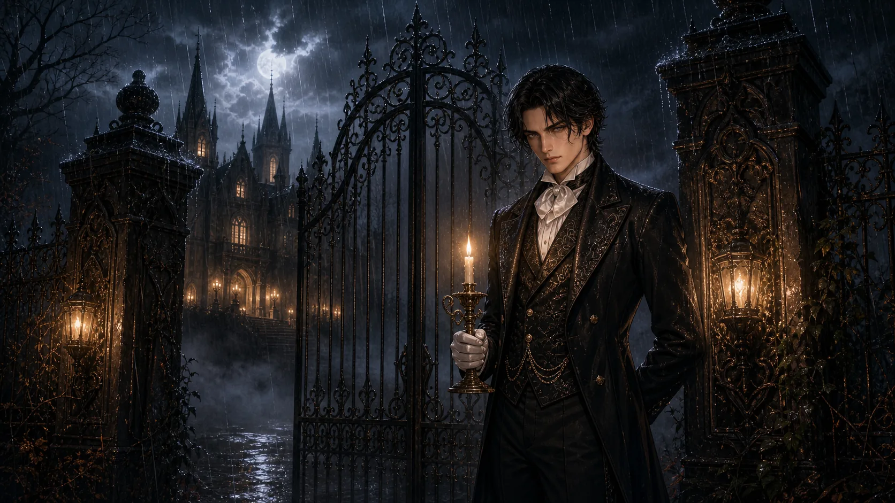

# セバスチャン ―真夜中の薔薇館―

> *「お嬢様。あなたの夜を、私が灯火と致しましょう。」*

公開URL: https://bazaarjapan.github.io/sebastian-game/

紹介動画: https://youtu.be/OIRRNmOXLKU

霧深い断崖の上に建つ「ヴァルディア伯爵邸」を舞台にした、Gothic / Victorian 調の恋愛シミュレーションゲーム。執事セバスチャンとの**はらはらどきどきの5章+4分岐エンディング**を体験できるブラウザゲームです。



---

## 特徴

- **5章構成のシナリオ** — 出会いから真実の口づけまで、約60シーンの分岐ストーリー
- **4種類のエンディング** — 好感度によって分岐 (TRUE / NORMAL / BITTERSWEET / BAD)
- **オープニング映像** — フル動画でゲーム世界へ誘い込み
- **シーンに応じた BGM クロスフェード** — 平常時/不穏時の2曲を場面に合わせて自動切り替え
- **Web Audio API 合成効果音** — タイプライター音・選択音・好感度UPチャイム (追加ファイル不要)
- **Glassmorphism HUD** — 背景アートを邪魔しない透過UI、操作なし2.5秒で自動フェード
- **セーブ&ロード** — `localStorage` に進行・好感度・BGMトラックを保存
- **完全静的サイト** — ビルド不要、GitHub Pages にそのまま公開可能

---

## 遊び方

1. オープニング動画を視聴 (またはスキップ)
2. タイトル画面で「物語を始める」を選択
3. 台詞をクリック (またはスペースキー) で次へ進む
4. 選択肢が出たら、セバスチャンへの返答を選ぶ
5. **章右上の好感度ハートゲージ**が選択によって変動
6. 全5章を経て、最終選択であなただけのエンディングへ

### 操作

| 操作 | 機能 |
|------|------|
| クリック / Space / Enter | 台詞を進める |
| クリック (タイプ中) | 全文を一気に表示 |
| ♪ ボタン | BGM・効果音 ON/OFF |
| ≡ ボタン | メニュー (セーブ / ロード / タイトルへ) |

---

## ローカルで動かす

ブラウザの autoplay/CORS ポリシーにより、`file://` で開くと動画と BGM が再生できません。**必ずHTTPサーバ経由で開いてください。**

```sh
# Python が入っていれば
py -m http.server 8765
# → http://localhost:8765/ を開く
```

Windows で `python` が Microsoft Store スタブの場合は `py` (launcher) を使ってください。

Node.js があれば `npx serve` でも可。

---

## GitHub Pages で公開する

1. このディレクトリをGitHubリポジトリに push
2. リポジトリの **Settings → Pages** で Source を `main` ブランチのルートに指定
3. 数分後 `https://<username>.github.io/<repo>/` で公開完了

ビルド工程は不要、すべて相対パスなのでサブディレクトリ配下でも動きます。

---

## ファイル構成

```
sebastian-game/
├── index.html      # エントリーポイント
├── style.css       # Gothic / Victorian テーマ
├── script.js       # ゲームエンジン (typewriter / Music / Sfx)
├── scenes.js       # 全シーンデータ + ストーリー
├── images/         # 立ち絵・背景 (5枚)
├── movie/          # オープニング動画
└── bgm/            # BGM 2トラック (平常時・不穏時)
```

詳細なアーキテクチャは [`CLAUDE.md`](./CLAUDE.md) を参照してください。

---

## 技術スタック

- **HTML5** + **CSS3** (`backdrop-filter`, `@keyframes`, glassmorphism)
- **Vanilla JavaScript** (ES2017+, IIFE モジュールパターン)
- **Web Audio API** — 効果音をリアルタイム合成
- **HTML5 Audio / Video** — BGMクロスフェード、オープニング映像
- **localStorage** — セーブデータ永続化
- **Google Fonts** — Cinzel / Cormorant Garamond / Shippori Mincho
- **依存関係なし** / **ビルドツールなし**

---

## ブラウザ対応

モダンブラウザ (Chrome / Edge / Firefox / Safari の最新版) を推奨。
`backdrop-filter` を使用しているため、古いブラウザではガラス効果が透明な単色に劣化します (機能には影響なし)。

---

## ライセンス

MIT License — 詳細は [LICENSE](./LICENSE) を参照。

ただし以下のアセットは別管理です:

- `images/*.webp` — ゲーム用キャラクターイラスト・背景
- `movie/movie.mp4` — オープニング映像
- `bgm/*.mp3` — BGM

これらの素材を再利用される場合は、それぞれの権利者に確認してください。
